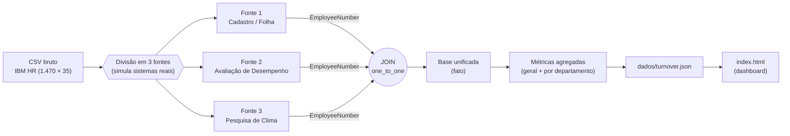

# Modelo de Dados — Diagnóstico de Turnover Grupo Avelar

> Como as três fontes simuladas se relacionam e como o dado flui até o dashboard.
> A chave que costura tudo é **`EmployeeNumber`**.

---

## 1. Visão geral do fluxo



## 2. As três fontes (modelo estrela simplificado)

`EmployeeNumber` é a **chave primária** de cada fonte e a **chave de junção** entre elas (relação 1:1).

```
                ┌─────────────────────────────┐
                │  FONTE 1 — Cadastro / Folha  │
                │  PK EmployeeNumber           │
                │     Age, Gender, MaritalStat │
                │     Department, JobRole,      │
                │     JobLevel, MonthlyIncome,  │
                │     DistanceFromHome,         │
                │     YearsAtCompany,           │
                │     TotalWorkingYears,        │
                │     Attrition  ◄── desfecho   │
                └──────────────┬───────────────┘
                               │ EmployeeNumber (1:1)
       ┌───────────────────────┼───────────────────────┐
       │                                               │
┌──────┴───────────────────────┐   ┌───────────────────┴──────────────┐
│ FONTE 2 — Avaliação           │   │ FONTE 3 — Pesquisa de Clima       │
│ PK EmployeeNumber             │   │ PK EmployeeNumber                 │
│    PerformanceRating          │   │    JobSatisfaction                │
│    OverTime                   │   │    EnvironmentSatisfaction        │
│    JobInvolvement             │   │    WorkLifeBalance                │
│    TrainingTimesLastYear      │   │    RelationshipSatisfaction       │
│    PercentSalaryHike          │   │                                   │
└───────────────────────────────┘   └───────────────────────────────────┘
```

## 3. Por que dividir e depois reunir?

Em qualquer empresa real, esses dados **não vivem juntos**: a folha está num sistema (ex.: ERP/RH), as avaliações em outro (ex.: módulo de desempenho) e a pesquisa de clima numa ferramenta de engajamento. O dado só vira diagnóstico quando alguém **integra as fontes pela chave do colaborador**.

Dividir o CSV único em três arquivos e reuni-los via *join* recria exatamente esse problema de integração — que é o trabalho real de tratamento de dados, e não "baixei um CSV e plotei".

## 4. Da base ao dashboard

1. **Base unificada (fato):** uma linha por colaborador, com todos os atributos das 3 fontes + os rótulos de varejo (de-para). Salva em `dados/base_unificada.csv`.
2. **Agregação:** as métricas são calculadas **uma vez por recorte** — geral ("Todos") e para cada departamento — e gravadas em `dados/turnover.json`.
3. **Consumo:** o `index.html` apenas **lê o JSON pronto**. O filtro de departamento troca o recorte já calculado; **nenhum cálculo pesado roda no navegador**.

## 5. Artefatos gerados

| Arquivo | Conteúdo |
|---|---|
| `dados/fontes/fonte1_cadastro_folha.csv` | Fonte 1 simulada |
| `dados/fontes/fonte2_avaliacao_desempenho.csv` | Fonte 2 simulada |
| `dados/fontes/fonte3_pesquisa_clima.csv` | Fonte 3 simulada |
| `dados/base_unificada.csv` | Fato após o join + de-para |
| `dados/turnover.json` | Métricas agregadas (geral + por departamento) consumidas pelo dashboard |

> O diagrama Mermaid acima renderiza automaticamente no GitHub e em editores compatíveis (VS Code com extensão Mermaid). O bloco ASCII serve como leitura rápida em qualquer visualizador.
